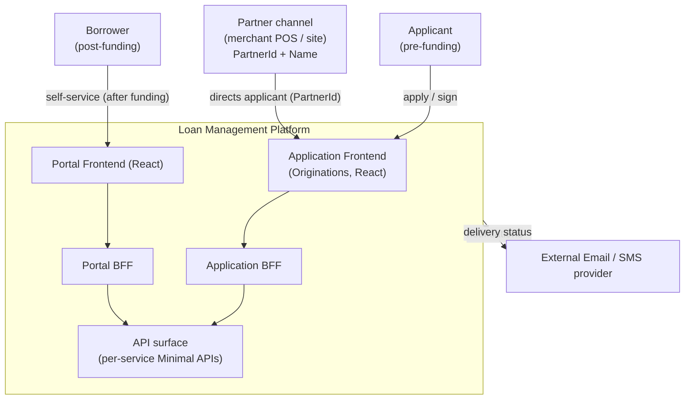
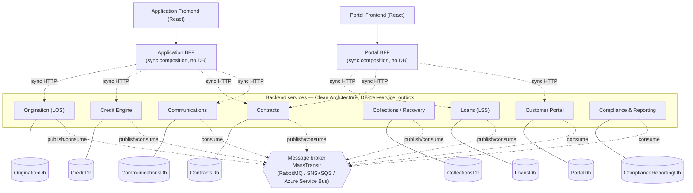
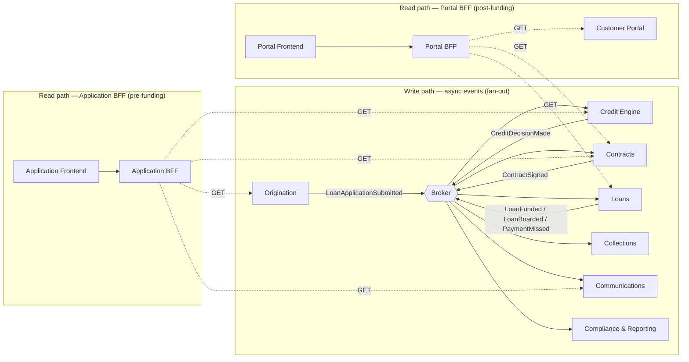
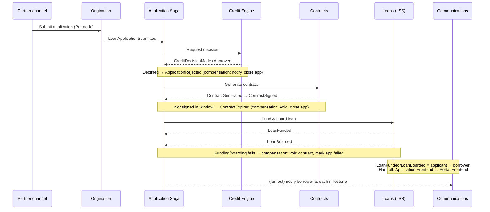

# Loan Management System — Partnership / Embedded Lending POC

A proof of concept for a small consumer-loan platform delivered through a **partnership channel**. Partners (merchants/retailers, assumed to already exist) offer *our* lending product to *their* customers at the point of credit. The customer becomes **our** borrower — we originate, decision, contract, service, and collect directly. The partner is a channel that earns reporting/commissions.

This POC is a **domain + architecture approach**: it makes the system design visible (high-level design, service boundaries, communication patterns) and provides an empty-but-wired Clean Architecture scaffold per service. Domain logic, the real event contracts, and the saga implementation are intentionally deferred to later deep-dive sessions.

> This document follows the four-step framework from [`.kiro/steering/30-system-design-framework.md`](../.kiro/steering/30-system-design-framework.md): **scope it → high-level design → deep dive → wrap up.**

---

## 1. Problem & Scope

### Problem statement

Build a lending platform that lets partners embed a small-consumer-loan offer into their own point-of-sale flow. An application submitted through a partner runs end-to-end through our system: origination → credit decision → contract → active servicing, with collections, communications, and compliance/reporting reacting throughout. We own the borrower relationship for the life of the loan.

### The partnership model (channel-only)

- A **partner** is the origination channel. Once an application is submitted, the customer becomes **our borrower**.
- We service and collect **directly**. The partner receives reporting and commissions (out of scope for this deliverable).
- Partners are **assumed to already exist**. They are referenced only by `PartnerId` (identifier) and a display `Name`. There is **no Partner/onboarding service** and no partner configuration aggregate in this POC.

### Functional requirements (representative)

- Accept a loan application through a partner channel, carrying `PartnerId`.
- Run a credit decision (approve / decline / refer).
- Generate a loan contract with fixed terms and capture signature.
- Board an approved, signed application as an active, amortized loan.
- Service the loan: schedule, payments, payoff.
- Detect delinquency and open a collections/recovery case.
- Notify the borrower (and partner) of key events via email/SMS.
- Provide a borrower self-service portal.
- Maintain an audit/compliance trail and reporting read models.

### Non-functional requirements & assumptions

- **Scale (illustrative):** POC-level. Assume low thousands of applications/day, not millions. The design should *shape* toward horizontal scale but not over-engineer for it (YAGNI).
- **Consistency:** each service is strongly consistent within its own boundary; cross-service state is **eventually consistent** via domain events.
- **Money:** single currency, fixed-term amortization, `Money` value object. Rates/terms are illustrative.
- **Stack:** .NET 9, **EF Core on SQL Server**, Clean Architecture per service, MassTransit + outbox for async messaging, React for the borrower portal UI.
- **Cloud:** logical design is **cloud-agnostic**; AWS and Azure equivalents are noted in the HLD but not committed to.

### In scope for this deliverable

- The high-level design: service boundaries, context/component/data-flow/sequence diagrams.
- The intended inter-service communication approaches (async events, BFF sync composition, saga orchestration) — **represented**, to be deep-dived later.
- An empty-but-wired 4-project Clean Architecture scaffold per backend service, a BFF, and a React portal shell that build and expose health endpoints.

### Out of scope for this deliverable

- Domain/business logic and invariants (aggregates are named, not implemented).
- Amortization/interest math.
- Real event-contract payloads and consumer implementations.
- Saga implementation (the workflow is designed and diagrammed only).
- Authentication/authorization wiring.
- Docker Compose, CI/CD pipelines, cloud provisioning.

These are the later deep-dives this POC sets up.

---

## 2. High-Level Design

### 2.1 Service boundary analysis

The request named **9 services**: Origination (LOS), Contracts, Communications, Credit Engine, Loans (LSS), Collections/Recovery, Customer Portal, Compliance, and Reporting. Applying the steering rule *"prefer larger cohesive services; split only on genuinely different lifecycles, teams, or scaling needs"* ([`15-microservices-best-practices.md`](../.kiro/steering/15-microservices-best-practices.md)):

| Original service | Decision | Rationale |
|---|---|---|
| Origination (LOS) | **Keep** | Clear transactional bounded context; the application entry point that carries `PartnerId`. |
| Credit Engine | **Keep** | Distinct decisioning lifecycle; scales/deploys independently of origination. |
| Contracts | **Keep** | Owns the loan agreement aggregate and signing; distinct lifecycle. |
| Loans (LSS) | **Keep** | The servicing core (schedule, payments); highest-value transactional context. |
| Collections / Recovery | **Keep** | Reacts to delinquency with its own case aggregate and workflow. |
| Communications | **Keep** | Event-driven side-effect service (email/SMS). Cohesive, single responsibility. |
| Customer Portal | **Keep (own backend service)** | Owns borrower-facing aggregates (preferences, saved views, secure-message inbox) that no other service should own. A React app + BFF sit in front of it. |
| Compliance | **Merge → Compliance & Reporting** | Read-heavy, event-consuming, no transactional aggregates. |
| Reporting | **Merge → Compliance & Reporting** | Also read-heavy projection work sharing the same lifecycle. Two tiny services that always deploy together would be a distributed-monolith smell. |

**Result: 8 backend services + a BFF + a React frontend.**

`PartnerId` + `PartnerName` are **not** a service — they are reference data carried on the `LoanApplication` and propagated on events to downstream services that need to attribute activity to a partner (reporting, communications).

### 2.2 Final service map

| Service | Bounded context | Core aggregate(s) | Role | Owns a DB? |
|---|---|---|---|---|
| **Origination (LOS)** | Loan applications | `LoanApplication` | Transactional; entry point; carries `PartnerId` | ✅ `OriginationDb` |
| **Credit Engine** | Underwriting decisions | `CreditDecision` | Transactional; decisioning | ✅ `CreditDb` |
| **Contracts** | Loan agreements | `Contract` | Transactional; terms, signing | ✅ `ContractsDb` |
| **Loans (LSS)** | Active loan servicing | `Loan`, `RepaymentSchedule` | Transactional; amortization, payments | ✅ `LoansDb` |
| **Collections / Recovery** | Delinquency & recovery | `DelinquencyCase` | Transactional; reacts to missed payments | ✅ `CollectionsDb` |
| **Communications** | Borrower/partner messaging | `NotificationLog` | Mostly consumer; sends email/SMS | ✅ `CommunicationsDb` |
| **Customer Portal** | Borrower self-service | `BorrowerProfile`, `MessageThread` | Transactional + read-model projections | ✅ `PortalDb` |
| **Compliance & Reporting** | Audit, regulatory, analytics | none (read models only) | Consumer / projection only | ✅ `ComplianceReportingDb` |
| **Application BFF** | Client aggregation (pre-funding) | none | Sync composition for the Application Frontend | ❌ (may cache) |
| **Portal BFF** | Client aggregation (post-funding) | none | Sync composition for the Portal Frontend | ❌ (may cache) |
| **Application Frontend** | Applicant UI (React) — pre-funding | — | Loan application / origination journey | ❌ |
| **Portal Frontend** | Borrower UI (React) — post-funding | — | Borrower self-service | ❌ |

**Two frontends, two BFFs — one per customer lifecycle stage.** A customer uses the **Application Frontend** (via the Application BFF) while applying, getting decisioned, and signing. Once the loan is **funded and boarded** (`LoanFunded` → `LoanBoarded`, owned by Loans), they graduate to the **Portal Frontend** (via the Portal BFF) for self-service. This follows the BFF pattern of one backend tailored per client, and keeps the pre- and post-funding experiences cleanly separated.

### 2.3 System context diagram



The **`LoanFunded` → `LoanBoarded`** conversion (owned by Loans) is the moment an applicant becomes a borrower — the handoff from the Application experience to the Portal experience.

### 2.4 HLD component diagram

Each backend service is a Clean Architecture .NET app with **its own SQL Server database** and an **outbox** table. Services never call each other synchronously and never share a database. All cross-service state change flows as **domain events** through the **message broker**. The **BFFs** are the only components making synchronous cross-service calls — the Application BFF for the pre-funding journey, the Portal BFF for post-funding self-service.



**Cloud equivalents (not committed):**

| Concern | AWS | Azure |
|---|---|---|
| Compute (container per service) | ECS Fargate | Container Apps |
| Message broker | SNS + SQS (or Amazon MQ / MSK) | Azure Service Bus |
| Relational DB (SQL Server) | RDS for SQL Server | Azure SQL Managed Instance |
| Secrets | Secrets Manager | Key Vault |
| Observability | CloudWatch + X-Ray | Application Insights + Azure Monitor |
| Edge / API entry | API Gateway + CloudFront | API Management + Front Door |

---

## 3. Deep Dive

The POC's thesis is about **how the services are bounded and how they communicate**, so the deep dive focuses there. Domain internals are deferred.

### 3.1 Communication approaches

Three patterns, matching the steering conventions ([`15`](../.kiro/steering/15-microservices-best-practices.md), [`17`](../.kiro/steering/17-event-driven-messaging.md)):

| Pattern | When used here | Why |
|---|---|---|
| **Async domain events (MassTransit + outbox)** — default | Every cross-service state change (application submitted, decision made, contract signed, loan boarded, payment missed) | Loose coupling, no runtime availability dependency, reliable at-least-once delivery via outbox |
| **BFF synchronous composition (one per frontend)** | A frontend needs an aggregated view *now* — the Application BFF composes the origination journey, the Portal BFF composes the borrower dashboard | Client needs a composed response immediately; only the BFFs make sync cross-service calls |
| **Saga / process manager (orchestration)** | The application lifecycle spanning Origination → Credit → Contracts → Loans (funding) | A multi-service workflow with ordering and compensation needs explicit coordination |

Rules carried from steering: events are **past-tense facts carrying IDs only**; consumers are **idempotent** (at-least-once delivery); publishers have **no knowledge of subscribers**; the **BFFs are the only** synchronous callers and build local read-model projections where they can.

### 3.2 Pluggable message transport (config-driven selection)

The async backbone must run on different brokers per environment — in-memory for tests, RabbitMQ for local Docker, a managed queue in the cloud — without touching consumers, publishers, or the outbox. All services select their transport from one config key.

**Why not a hand-rolled Strategy pattern.** A classic Strategy is a *runtime* algorithm swap behind a thin, stable interface. Transport selection is neither: it happens **once at startup**, and the transports have **genuinely different semantics** (see the queue-vs-log note below). Hiding them behind a custom `IMessagingStrategy` would either flatten everything to a lowest common denominator or leak `if transport == X` branches — the exact smell Strategy is meant to prevent. The right abstraction already exists: **MassTransit** is the transport-agnostic layer. Our job is only to *select and configure* the right one, so the pattern that fits is a **configuration-driven transport selector**, not Strategy.

The selector lives in a shared building block, `LoanManagement.Shared.Messaging`, and every service's `AddMessaging(config)` delegates to it:

```
Messaging:Transport = InMemory | RabbitMq | AmazonSqs | AzureServiceBus | Kafka
                             │
                             ▼
   AddLoanManagementMessaging(config)  ──selects──▶  one MassTransit transport
        (consumers, publishers, outbox are UNCHANGED across all of them)
```

| Transport | Model | Dead-letter | Status in POC |
|---|---|---|---|
| `InMemory` | in-process | n/a | Wired — default for local dev / tests |
| `RabbitMq` | broker, per-consumer queues | `_error` queue | Wired |
| `AmazonSqs` | SNS topics → SQS queues | `_error` redrive queue | Wired (`UsingAmazonSqs`) |
| `AzureServiceBus` | topics + subscriptions | dead-letter sub-queue | Wired (`UsingAzureServiceBus`) |
| `Kafka` | distributed **log** (consumer groups, offsets) | **none native** (dead-letter *topic*) | **Stubbed** — selectable, throws a documented `NotSupportedException` |

**Standardized retry + dead-letter.** The three queue transports share one retry policy (steering default: **3 retries, exponential 1s → 8s**, then the message moves to the transport's dead-letter/`_error` queue), applied centrally via `UseMessageRetry`. Change it in one place, every service inherits it.

**The queue-vs-log distinction (why Kafka is different).** RabbitMQ, Amazon SQS/SNS, and Azure Service Bus are **queue/broker** models and are first-class MassTransit *bus transports* (`UsingXxx`) with per-consumer queues and a native dead-letter queue. **Kafka is a distributed log** — consumers track **offsets** in partitions, and there is **no native DLQ** (you emulate one with a separate dead-letter *topic*). In MassTransit, Kafka is a **rider** attached to an existing bus, not a `UsingKafka` transport. It therefore can't slot into the same shape, so this POC leaves it **selectable but not wired**: choosing it fails fast with a clear message pointing at the rider approach, rather than pretending it behaves like a queue.

**Licensing caveat.** All transports are pinned to the **open-source MassTransit v8** line (v9+ is commercially licensed). If Kafka or the cloud transports are wired for real later, re-check the license terms for that version.

### 3.3 Data-flow diagram (async fan-out vs BFF sync)



### 3.4 Application-lifecycle saga (sequence)

The lifecycle is coordinated as a saga (state machine). Each forward step is triggered by an event; each step names a **compensation** for failure. *(Designed here; implementation is a later deep-dive.)*



Fan-out consumers **Collections/Recovery**, **Communications**, and **Compliance & Reporting** subscribe to these events throughout without being part of the saga's critical path. The **`LoanFunded` → `LoanBoarded`** transition is the lifecycle pivot: it converts the origination into an active loan and moves the customer from the Application experience to the Portal experience.

---

## 4. Per-Service Reference

Event names are illustrative and **past-tense**; payloads carry IDs only (real contracts are a later deep-dive). Each service owns its database and an outbox.

### Origination (LOS) — `OriginationDb`
- **Responsibilities:** accept partner-channel applications, validate intake, own the application lifecycle state, kick off the saga.
- **Aggregate:** `LoanApplication` (carries `PartnerId`, `PartnerName`, requested amount/term).
- **Publishes:** `LoanApplicationSubmitted`, `ApplicationRejected`, `ApplicationWithdrawn`.
- **Consumes:** `CreditDecisionMade`, `ContractSigned`, `LoanBoarded` (to advance/close application state).

### Credit Engine — `CreditDb`
- **Responsibilities:** evaluate an application and produce a decision (approve/decline/refer) with terms.
- **Aggregate:** `CreditDecision`.
- **Publishes:** `CreditDecisionMade`, `CreditDecisionReferred`.
- **Consumes:** `LoanApplicationSubmitted`.

### Contracts — `ContractsDb`
- **Responsibilities:** generate the loan agreement for an approved application, capture signature, manage expiry.
- **Aggregate:** `Contract`.
- **Publishes:** `ContractGenerated`, `ContractSigned`, `ContractExpired`, `ContractVoided`.
- **Consumes:** `CreditDecisionMade`.

### Loans (LSS) — `LoansDb`
- **Responsibilities:** fund a signed contract, board the resulting loan, own the amortization schedule, apply payments, track balance and payoff. **Owns the funding → loan conversion** (`ContractSigned` → `LoanFunded` → `LoanBoarded`) — the pivot from applicant to borrower.
- **Aggregates:** `Loan`, `RepaymentSchedule`.
- **Publishes:** `LoanFunded`, `LoanBoarded`, `PaymentApplied`, `PaymentMissed`, `LoanPaidOff`.
- **Consumes:** `ContractSigned`.

### Collections / Recovery — `CollectionsDb`
- **Responsibilities:** open and manage a delinquency case when payments are missed; drive recovery workflow.
- **Aggregate:** `DelinquencyCase`.
- **Publishes:** `DelinquencyCaseOpened`, `CaseEscalated`, `CaseResolved`.
- **Consumes:** `PaymentMissed`, `PaymentApplied`, `LoanPaidOff`.

### Communications — `CommunicationsDb`
- **Responsibilities:** send borrower/partner notifications (email/SMS) in reaction to milestones; log delivery.
- **Aggregate:** `NotificationLog` (write log, not a rich domain aggregate).
- **Publishes:** `NotificationSent`, `NotificationFailed`.
- **Consumes:** most milestone events (`LoanApplicationSubmitted`, `CreditDecisionMade`, `ContractSigned`, `LoanFunded`, `LoanBoarded`, `PaymentMissed`, `DelinquencyCaseOpened`, ...). On `LoanFunded`/`LoanBoarded`, notifies the borrower their loan is active and points them to the portal.

### Customer Portal — `PortalDb`
- **Responsibilities:** borrower self-service backend — profile/preferences, saved views, and a secure-message inbox. Builds local read-model projections from loan/contract events for fast portal reads.
- **Aggregates:** `BorrowerProfile`, `MessageThread`.
- **Publishes:** `BorrowerMessagePosted`, `PreferencesUpdated`.
- **Consumes:** `LoanFunded`, `LoanBoarded`, `PaymentApplied`, `ContractSigned` (to keep projections fresh; `LoanBoarded` is when a borrower's portal experience becomes available).

### Compliance & Reporting — `ComplianceReportingDb`
- **Responsibilities:** consume the full event stream to build an audit trail, regulatory read models, and analytics/reporting projections (including per-partner reporting via `PartnerId`). No transactional aggregates.
- **Aggregates:** none (read models / projections only).
- **Publishes:** nothing (terminal consumer).
- **Consumes:** all domain events.

### Application BFF (no DB)
- **Responsibilities:** compose responses for the pre-funding **Application Frontend** by calling Origination, Credit Engine, Contracts, and Communications synchronously (timeouts, circuit breakers, caching where freshness allows). One of only two components permitted to make cross-service sync calls.
- **Owns no domain, no aggregates.** May keep a short-lived cache.

### Portal BFF (no DB)
- **Responsibilities:** compose responses for the post-funding **Portal Frontend** by calling Loans, Contracts, and Customer Portal synchronously (same resilience posture). The other of the two permitted sync callers.
- **Owns no domain, no aggregates.** May keep a short-lived cache.

### Application Frontend (React) — pre-funding
- **Responsibilities:** applicant UI for the origination journey (apply, decision, sign). Talks only to the Application BFF.

### Portal Frontend (React) — post-funding
- **Responsibilities:** borrower self-service UI, available after `LoanFunded`/`LoanBoarded`. Talks only to the Portal BFF.

---

## 5. Wrap Up

### What this POC proves
- A defensible **service decomposition** for partnership/embedded lending, with the boundary decisions justified (merge Compliance+Reporting; Portal as its own backend service; no Partner service).
- The **intended communication approaches** — async events by default, BFF for sync composition, a saga for the application lifecycle — represented and ready to deep-dive.
- A consistent, **buildable scaffold** per service following Clean Architecture and the repo's steering conventions.
- A **pluggable message transport** (§3.2): InMemory / RabbitMQ / Amazon SQS / Azure Service Bus selectable by config, with Kafka documented, proving the async backbone isn't tied to one broker.
- **Funding consistency (CP)** (implemented in Loans, see [`src/Loans`](src/Loans)): the `ContractSigned → LoanFunded → LoanBoarded` flow funds **exactly once** under duplicate/at-least-once delivery, via **outbox + saga + idempotency** (not transport guarantees). Proven by unit + integration tests including duplicate-delivery and compensation.
- **Customer-surface availability (AP)** for both customer-facing surfaces, with the key insight that availability is a *different technique* at each end of the lifecycle:
  - **Customer Portal — read-side** (post-funding, see [`src/CustomerPortal`](src/CustomerPortal)): serves borrower reads from a **local event-built projection** (`BorrowerLoanView`) with idempotent, out-of-order-tolerant consumers, so reads survive Loans/Contracts outages.
  - **Customer Application / Origination — write-side** (pre-funding, see [`src/Origination`](src/Origination)): **accept-and-queue** submission via the outbox — an application is durably accepted even with every downstream service down.
  - Both **BFFs degrade gracefully** (partial `degraded=true` responses instead of 500s).
  - Together this delivers the "AP for the customer surfaces, CP for funding" goal. Proven by the Portal, Origination, and Loans integration tests.

### Tradeoffs made
- **Eventual consistency across services** in exchange for loose coupling and independent deployability. Cross-service reads may be briefly stale.
- **A saga adds coordination complexity** vs pure choreography, chosen because the application lifecycle has real ordering and compensation needs.
- **Merging Compliance + Reporting** favors cohesion over maximal separation; if their lifecycles diverge later, the expand-contract path is to split them.
- **BFFs as sole sync callers** centralize composition but must be watched for coupling/availability. **One BFF per frontend** (Application, Portal) adds a second small service to run, in exchange for cleanly separated pre-/post-funding experiences and independently evolvable client contracts.
- **Config-driven transport selection over a hand-rolled Strategy** (§3.2): leans on MassTransit as the abstraction rather than reinventing it. The cost is that not all transports are equivalent — Kafka's log model doesn't fit the queue+DLQ shape, so it's deliberately left stubbed rather than forced into a leaky common interface.

### What was intentionally left out
Domain logic, amortization math, real event payloads, saga implementation, auth, containerization, CI/CD, and cloud provisioning. See *Out of scope* in §1.

### Next scale / next deep-dives
1. ✅ **Funding-consistency slice in Loans** — outbox + `ContractSigned → LoanFunded → LoanBoarded` saga with compensation + idempotent consumption. **Done** (see [`src/Loans`](src/Loans)).
2. ✅ **Customer-surface availability slice** — Portal read-side projection + Origination write-side accept-and-queue + BFF graceful degradation. **Done** (see [`src/CustomerPortal`](src/CustomerPortal), [`src/Origination`](src/Origination)).
3. Extend the outbox + status-projection pattern to the remaining transactional services (Credit Engine, Contracts), promote the funding saga's in-memory repository to **EF-persisted** saga state, and lift the duplicated `OutboxProcessor` into a shared building block.
4. Flesh out **Loans (LSS)** amortization and payment application; wire the **Kafka rider** if a log-based transport is needed.
5. Add **auth** (partner channel M2M + borrower auth) and the Docker Compose topology; load-test and revisit scaling per [`28-scaling-system-design.md`](../.kiro/steering/28-scaling-system-design.md).

---

## Repository layout

```
loan-management-system/
  README.md                      # this document — the four framework steps
  LoanManagement.slnx            # solution (new XML format)
  Directory.Build.props          # shared TFM/lang settings (net9.0)
  Directory.Packages.props       # central package management (pinned versions)
  nuget.config                   # scopes NuGet to nuget.org
  .gitignore
  src/
    Origination/                 # Origination (LOS) — reference service
      LoanManagement.Origination.Domain/
      LoanManagement.Origination.Application/
      LoanManagement.Origination.Infrastructure/
      LoanManagement.Origination.Api/
      README.md
    CreditEngine/                # same 4-project layout (+ README.md)
    Contracts/
    Loans/
    Collections/
    Communications/
    CustomerPortal/
    ComplianceReporting/
    Shared/
      LoanManagement.Shared.Messaging/  # config-driven MassTransit transport selector
    Bff/
      LoanManagement.Bff.Application/   # Application BFF (pre-funding), no domain/DB
      LoanManagement.Bff.Portal/        # Portal BFF (post-funding), no domain/DB
      README.md
    ApplicationFrontend/         # pre-funding Originations UI
      frontend/                  # Vite + React + TS (port 5174)
      README.md
    PortalFrontend/              # post-funding borrower UI
      frontend/                  # Vite + React + TS (port 5173)
      README.md
  tests/
    LoanManagement.Origination.Architecture.Tests/
```

> **Solution format:** the .NET SDK generated a `LoanManagement.slnx` (the newer XML solution format), not a classic `.sln`. Both are valid; `dotnet build` / `dotnet test` at the repo root pick it up automatically.

### Build & run

```
dotnet build                     # builds all 35 .NET projects
dotnet test                      # runs the Origination architecture tests

# any service, e.g. Origination:
dotnet run --project src/Origination/LoanManagement.Origination.Api
#   -> GET /health/live, GET /health/ready

# BFFs:
dotnet run --project src/Bff/LoanManagement.Bff.Application   # -> GET /api/application/status
dotnet run --project src/Bff/LoanManagement.Bff.Portal        # -> GET /api/portal/dashboard

# frontends:
cd src/ApplicationFrontend/frontend && npm install && npm run dev   # pre-funding, :5174
cd src/PortalFrontend/frontend && npm install && npm run dev        # post-funding, :5173
```
